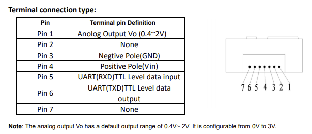

# CO2 Ampel

Dieses Repo enthält eine CO²-Ampel mit LCD Display, welche kontinuierlich die CO² Konzentration in der Umgebungsluft misst.
Die gemessen Werte werden als Zahlenwert (ppm) und in einer Ampel-Darstellung (Ok, Hoch, Kritisch) ausgegeben.


## Motivation

In Zeiten der Corona-Pandemie ist neben dem Tragen von Masken und dem Einhalten eines Mindestabstands ein **regelmäßiges Lüften** von gemeinsam genutzten Räumen sehr wichtig.
Anhand der CO² Konzentration lässt sich die Güte der Umgebungsluft abschätzen, insbesondere der Anteil der Ausatemluft, welche potentiell gefährliche Aerosole enthalten kann.
Mappt man die gemessenen Werte auf eine Ampelanzeige, kann hierüber eine **Lüftungsempfehlung** für den betroffenen Raum gegeben werden.

Eine detailliertere Erklärung finden Sie im Artikel [Der CO2-Warner für die Schule](https://www.heise.de/select/make/2020/5/2022015381334973804)
des [Make: Magazins 5/2020](https://www.heise.de/select/make/2020/5) des Heise Verlags.

## Hardware

Benötigte Hardware

* MHZ19 Sensor
* HD44780 LCD Display mit I2C Adapter
* Wemos D1-Mini
* Header und Kabel, ggf. Lüsterklemme
* Micro-USB Kabel
* Gehäuse (3D-Druck oder einfach eine Verpackungsbox, z.Bsp. Lindt Hello Schokolade)
* *Optional:* Power Bank (für mobile Nutzung)

## Pinbelegung


Die Spannungsversorgung für Sensor und Display erfolgt über den 5V Pin des D1-Mini, welcher wiederum über den USB-Anschluss mit Spannung versorgt und programmiert wird.

Die Pinbelegung wurde so gewählt, dass die Schaltung zur Neuprogrammierung nicht vom D1-Mini getrennt werden muss (TX und RX bleiben frei). Die eingebaute LED des D1-Mini kann noch verwendet werden (via D4). Außerdem stehen noch 2 GPIO-Pins mit Pull-Up/Down Widerständen zum Anschluss von optionalen Tastern zur Verfügung (D3 und D8).

Die Bauteile sind wie folgt zu verschalten.
Bei den mehrfach verbundenen Pins (5V und G) kam eine Lüsterklemme zum Einsatz.

| D1-Mini | MHZ19 Sensor  | HD44780 LCD Display |
|---------|---------------|---------------------|
| 5V      | VIN (rot)     | VCC                 |
| G       | GND (schwarz) | GND                 |
| D1      |               | SCL                 |
| D2      |               | SDA                 |
| D5      | TXD (grün)    |                     |
| D6      | RXD (blau)    |                     |

### MHZ19 Sensor

Der Sensor verfügt neben zwei Pin-Reihen, an welche Header angelötet werden können, auch über eine kleine Steckverbindung, welche ebenfalls die nötigen Pins zur Verfügung stellt.

Hiervon werden lediglich die Pins 3 (GND), 4 (Vin), 5 (RXD) und 6 (TXD) benötigt.



### LCD Display

Um das HD44780 LCD Display mit I2C ansprechen zu können, ist ein I2C-Adapter nötig. Für eine native Ansteuerung über den parallelen Datenbus (6 Pins für 4 Bit Datenbus, R/W und Enable) sind am D1-Mini zu wenig Pins verfügbar.

Der I2C-Adapter bietet zusätzlich die Möglichkeit, die LCD Hintergrundbeleuchtung via Software ein- und auszuschalten. Hiermit könnte man die Anzeige beim Erreichen der Warn-Schwelle blinken lassen.

Außerdem verfügt der I2C-Adapter über 2 Pins um die LCD Hintergrundbeleuchtung zusätzlich per Schalter ein- und auszuschalten zu können. So könnte man die Anzeige bei Dauereinsatz der CO2-Ampel über Nacht abschalten.

### Anschluss optionaler Taster

Zur Umsetzung einer Menüsteuerung können optional 2 Taster angeschlossen werden.
Durch Verwendung von GPIO-Pins mit internen Pull-Up/Down-Widerständen sind keine separaten Vorwiderstände nötig.

| D1-Mini        | Taster 1 | Taster 2 |
|----------------|----------|----------|
| 5V             |          | x        |
| G              | x        |          |
| D3 (Pull-Up)   | x        |          |
| D8 (Pull-Down) |          | x        |

Im Quellcode ist die Anbindung der Taster auskommentiert:

```cpp
#include <Bounce2.h>
...
// Taster
#define BTN1 D1MINI_D3
#define BTN2 D1MINI_D8
#define BTN_DEBOUNCETIME 50
...
Bounce bouncer1 = Bounce();
...
// setup menu buttons
pinMode(BTN1, INPUT_PULLUP);
bouncer1.attach(BTN1);
bouncer1.interval(15);
...
bouncer1.update();
if (bouncer1.fell())
{
  toggleAction();
}
```

## Software

Benötigte Software unter Windows 10:

* [Visual Studio Code](https://code.visualstudio.com/)
* [Git](https://git-scm.com/downloads)

Weitere Tools werden automatisch als VS Code Plugins installiert, sobald der Root-Ordner dieses Repositories in Visual Studio geladen wurde:

* VSCode und Git müssen installiert sein
* Windows Eingabeaufforderung öffnen (z.Bsp. mit `[Win]-R`, `cmd`, `[Enter]`)
* In den Ordner wechseln, der Code-Repositories enthalten soll (z.Bsp. `Source\Repos`) und dieses Repo mit Git clonen:

  ```cmd
  cd 
  mkdir Source\Repos
  cd Source\Repos
  git clone https://github.com/ramdacxp/co2-ampel.git
  cd co2-ampel
  ```

* In den neu angelegten Ordner wechseln und diesen in Visual Studio Code öffnen (`File > Open Folder ...` oder auf der Kommandozeile mit `code .`)
* Die vorgeschlagenen Erweiterungen (u.A. [Platform IO](https://marketplace.visualstudio.com/items?itemName=platformio.platformio-ide)) installieren
* Das Projekt übersetzen mit `Terminal > Run Build Task`


Der C++ Quellcode der CO²-Ampel befindet sich in der Datei `src\main.cpp`.

## Links

* [Der CO2-Warner für die Schule](https://www.heise.de/select/make/2020/5/2022015381334973804) im [Make: Magazin 5/2020](https://www.heise.de/select/make/2020/5)
* [Links und weitere Infos zum Make: Artikel](https://www.heise.de/select/make/2020/5/softlinks/xyrg?wt_mc=pred.red.make.make052020.010.softlink.softlink)
* [CO2-Ampel Artikel](https://www.un-hack-bar.de/2021/01/02/neues-jahr-neue-runde-co2ampel/) im Blog der [Un-Hack-Bar](https://www.un-hack-bar.de/)
* [Un-Hack-Bar Git Repo](https://git.unhb.de) mit CO2-Ampeln:
  * [smash/co2ampel](https://git.unhb.de/smash/co2ampel)
  * [smash/ebk-unhb-co2ampel](https://git.unhb.de/smash/ebk-unhb-co2ampel)
* [Tutorial zur Ansteuerung eines LCD Displays HD44780 via I2C am ESP8266 D1-Mini](https://makesmart.net/lcd-display-hd44780-i2c-esp8266-d1-mini-tutorial/)

## Lizenz

[MIT License](LICENSE)
